# FoilsMode
## 5D → 6D Bayesian Optimization of the Mu2e Stopping-Target Foil Stack

**Y. Oksuzian**
2026-06-02
Mu2e — autoresearch / closed-loop BO

---

## Motivation

- Does modifying the **stopping-target foil stack** buy CE efficiency?
- Open a BO line over **extra foils added upstream / downstream** of the
  current deployed stack.
- Keep the deployed 37-foil base **pinned** — any movement in (sob, calo)
  is attributable to the +12 envelope.

---

## The physical knob

**Base 37-foil stack (deployed v02, pinned):**
- `rOut = 75 mm`, `halfThickness = 0.0528 mm` (≈ 105.6 µm full)
- `holeRadius = 21.5 mm`, 37 foils, fixed spacing

**The +12 envelope (optimized):**
- ≤ 6 extra foils **upstream**
- ≤ 6 extra foils **downstream**
- All extras share **one** (rOut, halfThickness, rIn) triple

---

## 5D search space

| Knob                  | Type    | Range          |
|-----------------------|---------|----------------|
| `n_up`                | Integer | 0 – 6          |
| `n_down`              | Integer | 0 – 6          |
| `extra_rOut`          | Real    | 50 – 250 mm    |
| `extra_halfThickness` | Real    | 0.05 – 1.0 mm  |
| `extra_rIn`           | Real    | 0 – 50 mm      |

**Objective:** `obj = S/√B − α · calo / POT`  (α = 1 × 10⁵)

---

## Pipeline

```
propose → preflight (G4 surface check)
       → mubeam → run1b_mubeam → concat → mustops_ce
       → harvest → scan_logs → leaderboard
```

- LangGraph state machine; **q** (batch size) children per round.
- **Gaussian Process (GP)** surrogate refit between rounds.
- **Expected Improvement (EI)** acquisition: exploit (mean) vs explore (σ).
- **Constant Liar — Min (`cl_min`)** for batch: feed in-flight picks
  the worst observed `obj`, refit GP, re-pick. Spreads the batch; cheaper than qEI.
- **Stop:** `--max-rounds`.

---

## Batch BO: qEI — the "proper" multi-point EI

**Plain EI (`q=1`):** pick the single point that maximizes expected
improvement over the current best `obj`.

**qEI (`q>1`):** pick `q` points **jointly** so the **best of the q** is
expected to improve the most. The question changes from
*"what's the best next point?"* to *"what's the best batch of `q` points
to try in parallel?"*

**The math:** integrate over the GP's **joint posterior** at all `q`
candidate locations at once. Points that are correlated (close together)
contribute redundantly to the integral, so the optimizer **naturally
spreads** them. No lies needed — the math handles it.

---

## Why we don't use qEI: cost

**The joint integral has no closed form for `q > 1`:**

- Monte Carlo over **thousands** of GP samples per candidate batch.
- Acquisition optimizer searches over `q × d` dimensions
  (here 5D × q=10 = **50D**) instead of just `d` (5D).
- Each acquisition evaluation costs **~100–1000×** a single-point EI eval.

**Constant Liar is the cheap proxy:**
sequentially pick `q` points, lying about the in-flight ones. You get most
of the spreading benefit at the cost of `q` single-point EI optimizations
— **linear in `q`** instead of exponential.

That's why we run `cl_min`, not qEI. BoTorch supports real
qEI / qNEHVI (Monte Carlo); benchmarked on a sibling problem — skopt's
`cl_min` was good enough at this scale.

---

## Phase 0: preflight passes the extreme corners

Three extreme-corner configs hand-built and run through G4 surface-check **before any grid submit**:

| name         | n_up | n_down | rOut | hT  | rIn | radii len | Result |
|--------------|------|--------|------|-----|-----|-----------|--------|
| `foilsP0_AU` | 6    | 0      | 250  | 1.0 | 50  | 43        | **PASS** |
| `foilsP0_AD` | 0    | 6      | 250  | 1.0 | 50  | 43        | **PASS** |
| `foilsP0_AS` | 6    | 6      | 250  | 1.0 | 50  | 49        | **PASS** |

All three: `total_hits = 1, baseline = 1, managed = 0` — no overlap.

**Full 5D box is buildable** — no defensive clamp needed.

---

## Run timeline

| Run     | q  | Rounds | Evals | Status                                  |
|---------|----|--------|-------|-----------------------------------------|
| X01     | 10 | 1      | 10    | Sobol bootstrap, all PASS preflight     |
| X02     | 10 | 3      | 30    | clean, frontier still moving            |
| X03     | 10 | 5      | 50    | frontier widening                       |
| X04     | 10 | 10     | 0     | **silent fail** (all preflight rc=3)    |
| X05     | 10 | 3      | 30    | clean, frontier tightening              |
| X06     | 10 | 3      | 28    | 2 children lost to name-fork bug (#172) |
| X07     | 10 | 10     | 83    | **champion R01_03 obj=2.178**; SAT R02+ (17 zero-row sidecars) |
| **X08*** | 10 | 5     | 8 / 50 | **qNEHVI picker (BoTorch)** — R00 done best obj=1.79; in-flight |

<!-- run-timeline:start -->
**Leaderboard now: 251 evals** (X01=10, X02=29, X03=34, X05=25, X06=22, X07=83, X08=47; X04 wiped — see ambiguous-preflight incident).
<!-- run-timeline:end -->
*X08 = first qNEHVI production run (`--picker qnehvi`, [[batch-bo]]); contrasts the LOCO finding that CL-min wins 4/5.*

---

## GP cloud evolution (animated)

<div style="display: grid; grid-template-columns: 60% 40%; gap: 20px; align-items: center;">
<div>

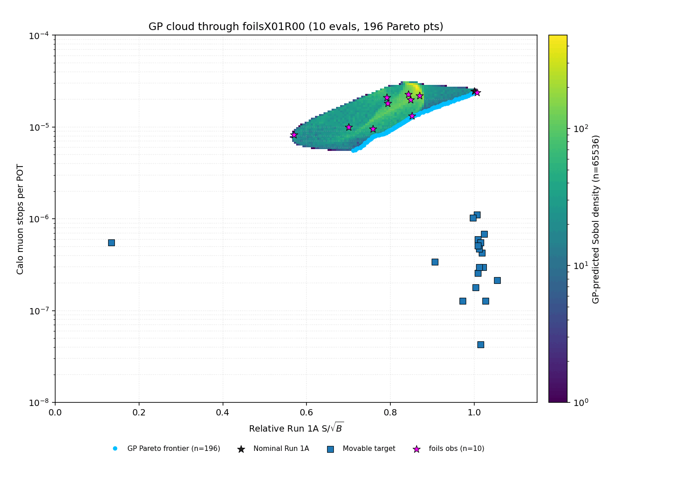

</div>
<div>

**Frontier widened across X01 → X07:**

- sob peak: **3.31 → 3.62** (+9 %)
- calo floor: **5.6 × 10⁻⁶ → 1.6 × 10⁻⁶** (3.5× drop)
- Plateau in last 5 rounds — see saturation slide.

</div>
</div>

---

## GP cloud (static snapshot)

<div style="display: grid; grid-template-columns: 60% 40%; gap: 20px; align-items: center;">
<div>

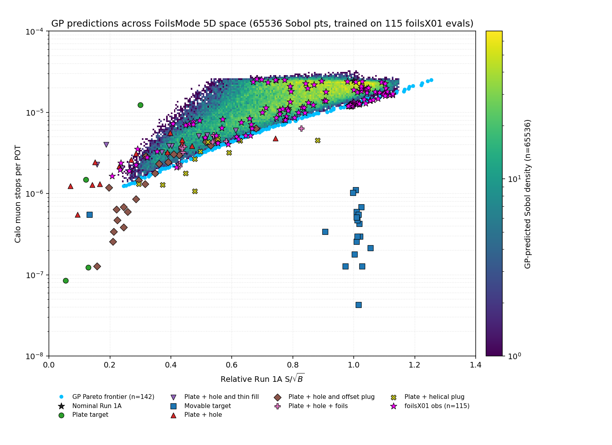

</div>
<div>

<!-- highlights:start -->
- **251 evals**, frontier saturated
- Best **obj = 2.18** (sob 3.60, calo 1.42 × 10⁻⁵); calo floor **8.9e-07**
- Winning region: `n_down = 6`, `rOut ≈ 164 mm`, thin `hT`
<!-- highlights:end -->

</div>
</div>

---

## BoTorch cross-check (same data, different surrogate)

<div style="display: grid; grid-template-columns: 60% 40%; gap: 20px; align-items: center;">
<div>

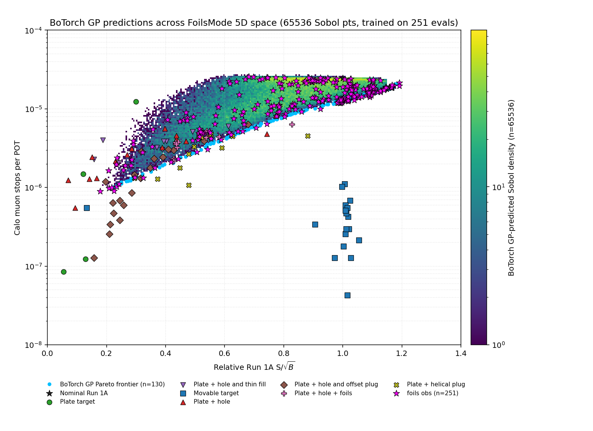

</div>
<div>

<!-- botorch-cross-check:start -->
- BoTorch `SingleTaskGP` re-fit on the same **n=251** rows
- Observed extrema: **sob_max 3.93**; **calo_min 8.95e-07**
- Cross-model agreement → foils saturation is **model-independent** (same conclusion as helical)
<!-- botorch-cross-check:end -->

</div>
</div>

---

## Picker diversity: BoTorch qNEHVI vs skopt CL-min (q=10, n=164)

<div style="display: grid; grid-template-columns: 60% 40%; gap: 20px; align-items: center;">
<div>

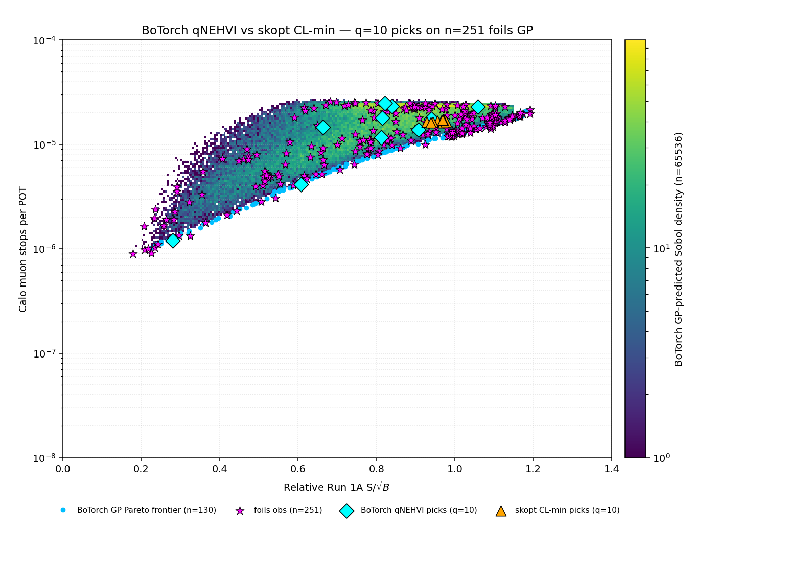

</div>
<div>

- Intra-batch spread (normalized 5D L2): **BoTorch 0.83**, **CL-min 0.10**
- Predicted Pareto dominance: **CL-min 10/10**, BoTorch 0/10
- **Reversal vs n=128** (was BoTorch 10/10): champion ridge sharpened → CL-min collapses *onto* it; qNEHVI scatters into worse corners
- Operational: keep **both pickers in rotation**, don't crown one

</div>
</div>

---

## Saturation diagnostic (post-hoc FoM)

<div style="display: grid; grid-template-columns: 62% 38%; gap: 12px; align-items: center; font-size: 18px;">
<div>

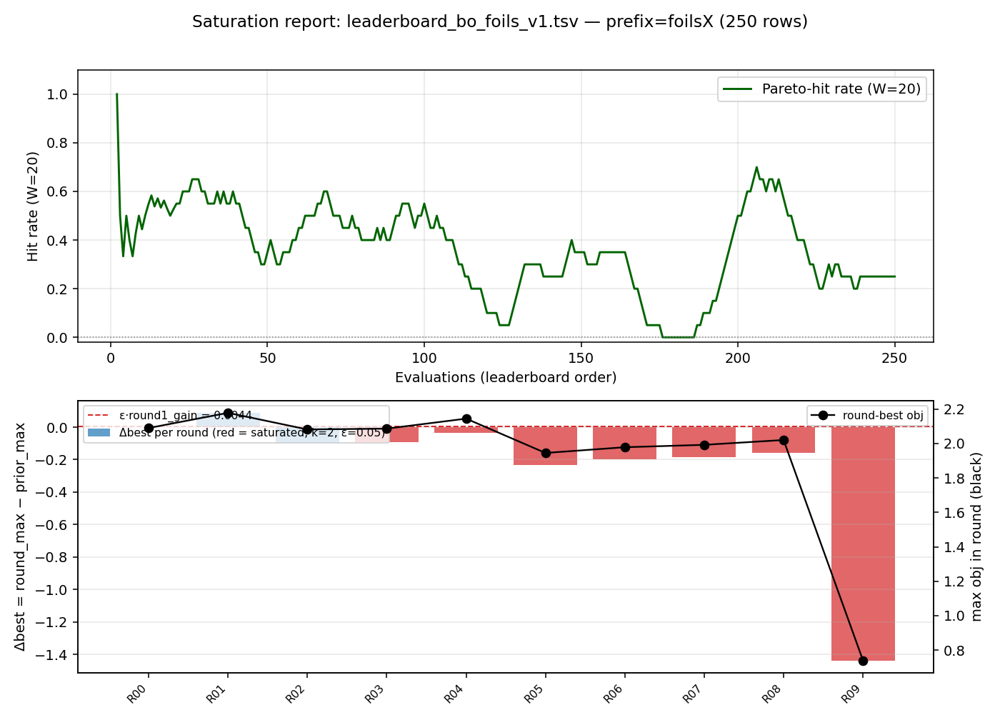

</div>
<div>

**Δbest = max(obj_round) − max(obj_all_prior)**
SAT when Δbest ≤ ε·R1-gain for last *k*=2 rounds (ε=0.05).

- Anchor (R1) = **+0.088**, champion obj = **2.178** at X07R01_03
- Δbest **negative for 8 consecutive rounds** (R02–R09)
- Hit-rate first 20 / last 20: **55 % → 65 %** — rebounded after X08 R00 (qNEHVI) scattered into fresh corners; **HV grew but obj-best ceiling did not move** → diversity indicator, not a saturation indicator
- **VERDICT: SATURATED** (per-round Δbest plateau is the load-bearing signal) — next is a dimensionality lift, not more rounds

</div>
</div>

---

## Frontier progress: HV + Pareto-front size

<div style="display: grid; grid-template-columns: 50% 50%; gap: 12px; align-items: center; font-size: 17px;">
<div>

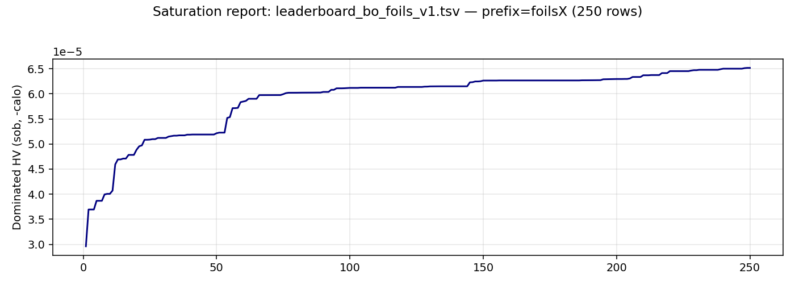

**Dominated hypervolume (sob, −calo)** — area swept by the
Pareto frontier vs ref point. Monotone non-decreasing; a flattening
curve is the strongest single-number "we have converged" signal.

</div>
<div>

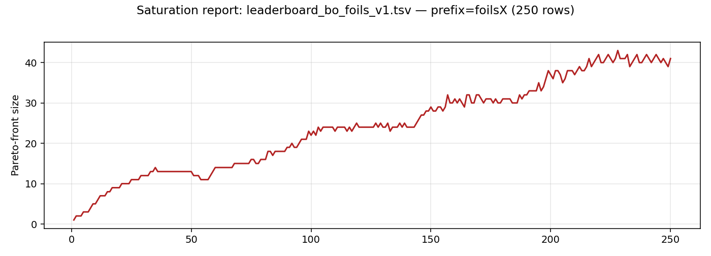

**Pareto-front size** — number of non-dominated points. Can DROP
(new evals dominate old frontier members) → the GP is *moving*,
not just *extending* the frontier. Healthy churn ≠ saturation.

</div>
</div>

Both panels: x = evaluation index in leaderboard (harvest order).

---

## Obj champion geometry — foilsX07R01_03

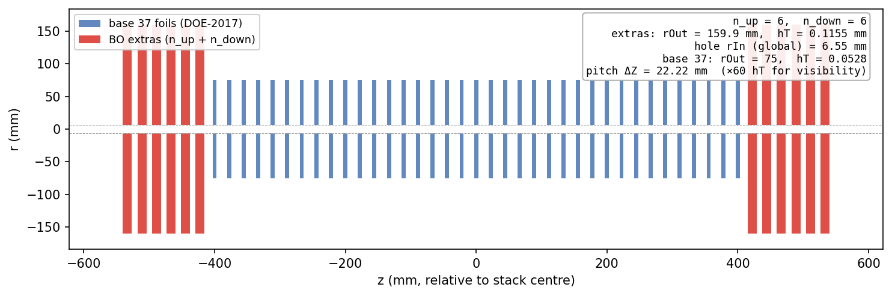

- **n_up=6 / n_down=6** max-extras; rOut≈160, hT≈0.116, hole rIn≈6.5 mm
- Joint sob+calo optimum (obj = 2.178); pitch ΔZ=22.22 mm from base

---

## Sob-only champion geometry — foilsX08R04_08

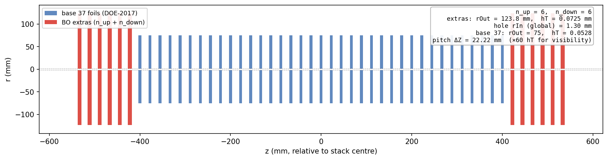

- Same max-extras corner; **smaller rOut≈124, thinner hT≈0.073, rIn≈1.3 mm**
- Pure S/√B ridge: sob=3.93, but calo ~38% higher → obj=1.97

---

## Top configurations so far

| config             | n_up | n_down | rOut  | hT    | rIn  | sob  | calo (×10⁻⁵) | obj  |
|--------------------|------|--------|-------|-------|------|------|---------------|------|
| `foilsX07R01_03`   | 6    | 6      | 159.9 | 0.116 | 6.5  | 3.60 | 1.42          | **2.178** |
| `foilsX07R01_08`   | 5    | 5      | 150.7 | 0.132 | 6.9  | 3.62 | 1.48          | 2.145 |
| `foilsX03R04_02`   | 5    | 6      | 184.4 | 0.121 | 0.0  | 3.43 | 1.29          | 2.144 |
| `foilsX07R01_01`   | 6    | 6      | 157.2 | 0.116 | 7.3  | 3.60 | 1.47          | 2.128 |
| `foilsX05R01_03`   | 6    | 6      | 165.6 | 0.151 | 0.0  | 3.36 | 1.26          | 2.104 |

**Pattern (top-5):** **max-extras** dominates — `n_up ∈ {5,6}, n_down ∈ {5,6}`,
`rOut ≈ 150-185 mm`, `hT ≈ 0.12-0.15 mm`, `rIn ≈ 0-7 mm`. The X07R01 batch
placed **3 of the top-5** in a tight cluster around (n_up=6, n_down=6, rOut≈160) —
champion ridge sharpened, then 5 rounds of failed exceedence attempts.

---

## Open questions / next steps

- **5D space saturated** at n=212 (R02–R09 all negative Δbest, 8
  consecutive rounds below ε·anchor). Champion **foilsX07R01_03 obj = 2.178**.
- LOCO honest-judge eval (last 5 cohorts, held-out judge GP): **CL-min
  wins 4/5**, Δ(BO−CL) mean = **−0.53**. → keep CL-min as production
  picker; the prior "switch to BoTorch" claim was self-referee bias.
- **Next move is a dimensionality lift, not more rounds:** promote
  base hole-radius and/or base halfThickness to BO knobs (6th/7th
  dim), or open a parallel BO line on stack-spacing.
- Process fixes landed during X04→X07: ambiguous-preflight retry
  (#162), per-launch unique thread_id (#165), zero-row classifier
  + sidecar (#167), `node_propose` re-entry name preservation (#172),
  `sourced_env` stderr leak fix (#170).

---

## v2 — the dimensionality lift (foilsY)

The 5D frontier **saturated** at obj = 2.178 — so the next move is *more
dimensions, not more rounds*. **foilsY** is that lift:

**5D → 6D, per-side decoupled.** v1 forced all extras to share one
`(rOut, hT, rIn)` triple. v2 gives **upstream and downstream their own**:
`(rOut, hT, rIn) × (up / dn)`.

- `n_up = n_down = 6` **pinned** — both v1 champions railed there.
- Base 37 still pinned; a new per-foil **`holeRadii` vector** decouples the
  extras' hole from the fixed base hole = 21.5 mm (patched `StoppingTargetMaker`).
- Warm start: the v2 leaderboard + the **1 base-hole-valid v1 prior** — the
  other 50 v1 rows measured a base geometry v2 can't reproduce, so they're dropped.

→ **First question:** does decoupling up / dn buy anything the diagonal can't reach?

---

## foilsY: first 6D cloud

<div style="display: grid; grid-template-columns: 60% 40%; gap: 20px; align-items: center; font-size: 18px;">
<div>

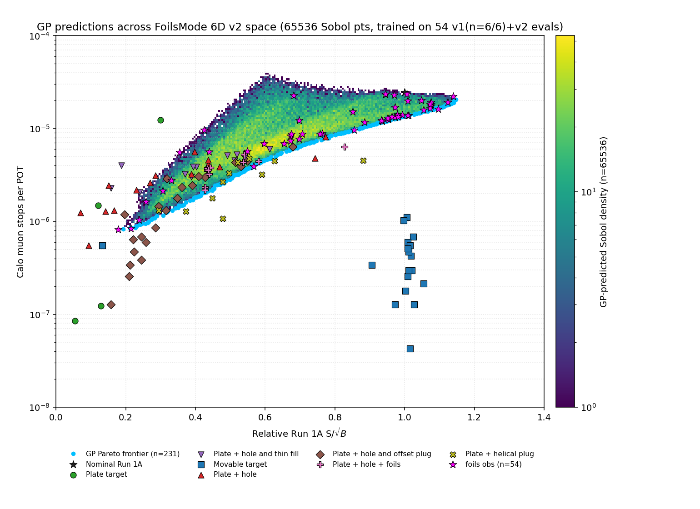

</div>
<div>

**v2 read** (n = 54: 1 prior + 53 foilsY, Y01–Y05):

- Best **obj = 2.00** (sob 3.62, `foilsY02R03_01`) — an **asymmetric** pick
  (up ≠ dn), still the v2 ceiling
- **cl_min plateaued: 4 campaigns, none beats 2.00** (all ~1.9–2.0 on one ridge)
- **Next lever: qnehvi or a 7th dim** — `foilsY05` (10-round) is the last
  cl_min attempt
- `rIn` dims under-trained → interpolation, not extrapolation

</div>
</div>

---

## Top foilsY configurations (v2, 6D)

| config           | rOut ↑/↓  | hT ↑/↓      | rIn ↑/↓ | sob  | calo (×10⁻⁵) | obj   |
|------------------|-----------|-------------|---------|------|--------------|-------|
| `foilsY02R03_01` | 149 / 160 | 0.05 / 0.17 | 0 / 50  | 3.62 | 1.62         | **2.003** |
| `foilsY04R03_00` | 135 / 175 | 0.16 / 0.17 | 0 / 50  | 3.34 | 1.38         | 1.963 |
| `foilsY04R03_01` | 133 / 188 | 0.14 / 0.18 | 0 / 50  | 3.33 | 1.39         | 1.943 |
| `foilsY02R03_02` | 159 / 161 | 0.05 / 0.23 | 7 / 0   | 3.48 | 1.57         | 1.905 |
| `foilsY04R02_02` | 146 / 194 | 0.05 / 0.25 | 0 / 50  | 3.24 | 1.34         | 1.904 |

**Pattern (top-5):** the v2 optima are **asymmetric** — moderate rOut
(≈130–195, *not* the rOut=250 boundary cl_min drifts to), thin hT, and a
striking **rIn split: upstream solid (rIn↑=0), downstream fully holed
(rIn↓=50)** in 4 of 5. The up ≠ dn decoupling v1's coupled space *couldn't*
express is exactly what the champions exploit — yet it still caps at obj ≈ 2.0.

---

## foilsY saturation: cl_min at its ceiling

<div style="display: grid; grid-template-columns: 60% 40%; gap: 20px; align-items: center; font-size: 18px;">
<div>

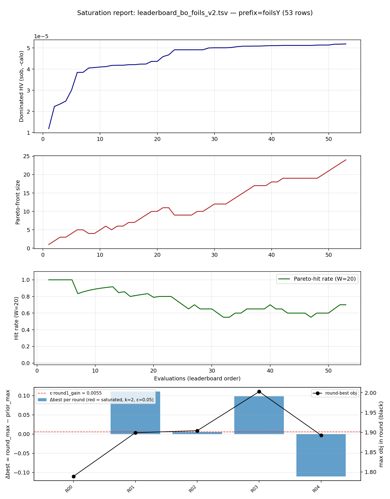

</div>
<div>

53 v2 evals (Y01–Y05). **Hit-rate 80% → 70%**, HV flattening — frontier softening.

- **Per-round Δbest pools the campaigns** (each reuses R00–R09): tops at
  **2.00 (foilsY02's R03)**, R04 dips — FoM says "not saturated" but is
  cross-campaign-blind.
- **Real signal: 4 cl_min campaigns, none > 2.00.**
- **foilsY05** (10-round) → clean single-run curve.

</div>
</div>

---

## What's next — v3: open the downstream hole

<div style="font-size: 20px;">

**Diagnosis of the plateau.** The top-5 v2 configs are *asymmetric* — upstream
solid (`rIn↑→0`), downstream holed — and **`rIn_dn` pegs at its search ceiling
(50 mm)** in the champions. rOut stays interior; only the downstream hole presses
on the box. **The optimum wants a hole bigger than the box allows.**

**Fix — fractional holes (v3 / `foilsf`).** Reparameterize the hole as a
*fraction* of its outer radius, `f = rIn/rOut`, `f ∈ [0, 0.95]`:

- reaches `rIn` up to ~0.95·rOut (**≈190 mm** vs the old **50 mm** cap)
- **no infeasible region** — `f < 1` ⇒ hole always inside the foil
- **lossless reuse** — all 53 v2 evals map in exactly (`f = rIn/rOut`, same
  geometry), so v3 starts fully warm

**`foilsZ01`** (foilsX 5D → foilsY 6D abs → **foilsZ 6D fractional**; q=3,
cl_min, 5 rounds). The question: does a bigger downstream hole break the
obj ≈ 2.0 ceiling — or is 2.0 a real physical limit, not just a box edge? →

</div>

---

## v3 result: 2.0 is a real ceiling, not a box edge

<div style="display: grid; grid-template-columns: 58% 42%; gap: 18px; align-items: center; font-size: 16px;">
<div>


</div>
<div>

15 evals (foilsZ01). Best obj climbs **1.12 → 1.41 (R03)**, then **R04 regresses
to 1.20** — never near the v2 bar **2.00**.

- **R01 probed the big hole** (`rIn_dn = 238 mm`, impossible in v2) → **sob
  collapses 3.4 → 1.69**: thin ring, far off-axis, misses the muons.
- The climb back to 1.41 is a *retreat* to small/moderate holes.
- **cl_min's `f_dn = 0.95` peg self-corrected** — it reached the moderate
  interior (`f ≈ 0.1–0.7`) on its own and *still* couldn't break 2.0.

**Verdict: opening the hole doesn't help — obj ≈ 2.0 is physical, not a box
edge.** All-time best stays the v1 champion **`foilsX07R01_03`, obj = 2.178**.

**Now running:** `foilsZ02` (qNEHVI, 10 rounds) — does a different acquisition
find what cl_min's greedy picks missed?

</div>
</div>
