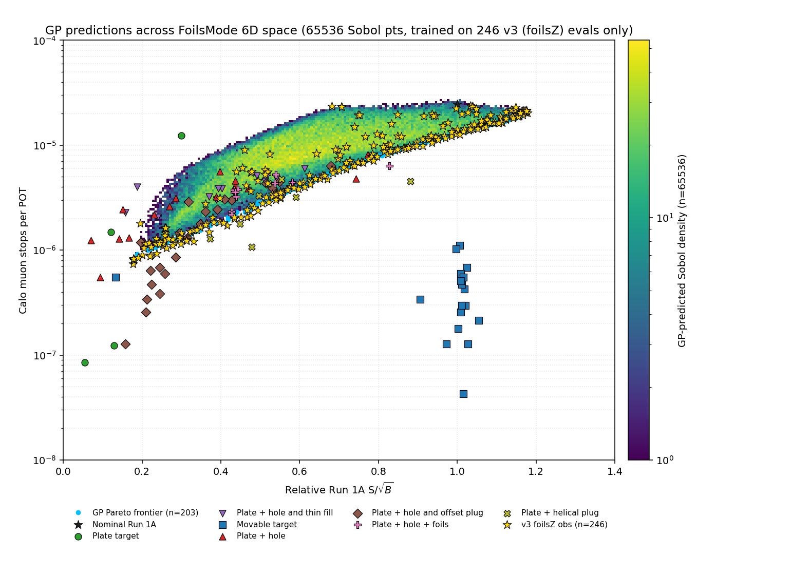
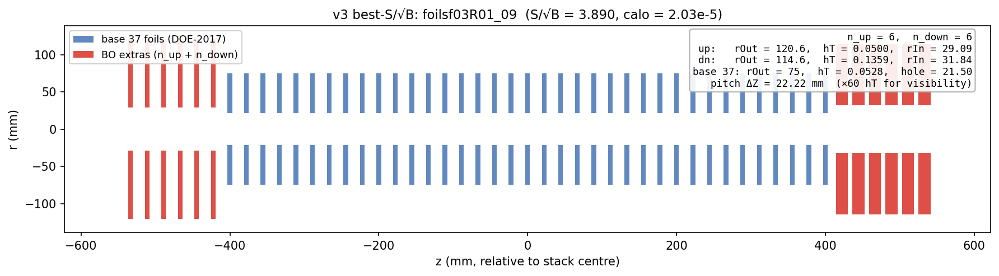
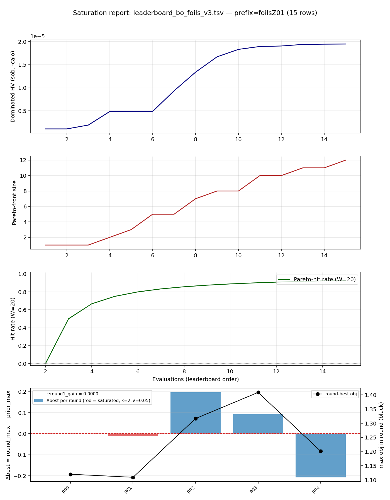
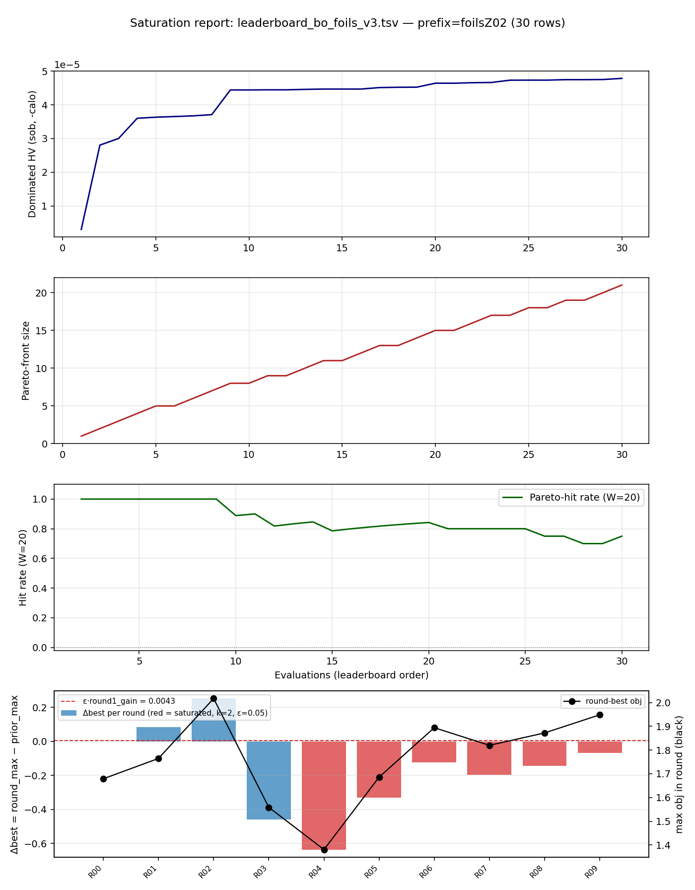

# Stopping-Target Foil Optimization
## v3 — fractional-hole geometry, Pareto-HV Bayesian Optimization (qLogNEHVI)

**Y. Oksuzian**
2026-06-06
Mu2e — autoresearch / closed-loop BO

---

## What we optimize

Add **extra foils** up/downstream of the pinned **37-foil** stopping-target base
(deployed spec: `rOut=75`, `halfThickness=0.053 mm`, `holeRadius=21.5` — fixed).

**6-D knob set** (**6 upstream + 6 downstream extras**, one shared triple per side):

| knob | range |
|---|---|
| `extra_rOut_up / dn` | 50 – 250 mm |
| `extra_halfThickness_up / dn` | 0.05 – 1.0 mm |
| `extra_f_up / dn`  — hole **fraction** `f = rIn/rOut` (`f<1` ⇒ always buildable) | 0 – 0.95 |

**Two competing goals:** **maximize** `S/√B` (Run1A CE significance) and
**minimize** `calo` (Run1B calo-stop background). We optimize the **trade-off
between them directly** — and report the achievable front.

---

## The optimizer: qLogNEHVI

Closed-loop BO: refit a GP on every eval, propose `q` candidates per round, run
them in parallel on the grid, repeat.

**Acquisition = qLogNEHVI** (log Noisy Expected Hypervolume Improvement):

- **Multi-objective** — maximizes the Pareto hypervolume of `(S/√B, −log calo)`;
  maps the whole `S/√B`–`calo` trade-off front in one run.
- **Noisy** — marginalizes the ~8% calo measurement noise (right for our
  stochastic G4 metrics).
- **Log-stabilized** — fixes the vanishing-gradient failure of plain qNEHVI, so
  the candidate optimizer keeps finding good points **even near saturation**.

---

## The 6-D Pareto landscape

GP density over the 6-D space, **247 evals**; **gold = exploration picks**.

- Exploration maps the **whole front** in one campaign.
- The **off-axis big-hole corner** (far left, low `S/√B`): a thin ring at large
  `rOut` sits far off the beam axis and misses the muons — it's the ring's
  **absolute radius** that matters, not the fraction `f`.
- The frontier is **soft and broad** — no single sharp optimum.

---

## The result: best S/√B at a calo budget

Just *"how much signal if you cap the calo background at B?"* (**247 evals**):

<table class="geom-tbl">
<tr><th>calo budget <code>B</code></th><th>best <code>S/√B</code></th><th>at calo</th><th>upstream extras (×6)</th><th>downstream extras (×6)</th></tr>
<tr>
  <td>≤ 1e-6 (clean detector)</td><td>0.73</td><td>8.9e-7</td>
  <td>
    <svg width="48" height="48" viewBox="-35 -35 70 70"><circle cx="0" cy="0" r="30" fill="#3355aa"/><circle cx="0" cy="0" r="9" fill="none" stroke="#cc0000" stroke-width="1.5" stroke-dasharray="2,2"/></svg>
    solid disc rOut=250 full thick 2.0 mm
  </td>
  <td>
    <svg width="48" height="48" viewBox="-35 -35 70 70"><circle cx="0" cy="0" r="30" fill="#3355aa"/><circle cx="0" cy="0" r="9" fill="none" stroke="#cc0000" stroke-width="1.5" stroke-dasharray="2,2"/></svg>
    solid disc rOut=250 full thick 0.99 mm
  </td>
</tr>
<tr>
  <td>≤ 1e-5 (<b>knee</b>)</td><td><b>3.01</b></td><td>9.9e-6</td>
  <td>
    <svg width="48" height="48" viewBox="-35 -35 70 70"><path d="M25.3,0 A25.3,25.3 0 1,0 -25.3,0 A25.3,25.3 0 1,0 25.3,0 M11.6,0 A11.6,11.6 0 1,1 -11.6,0 A11.6,11.6 0 1,1 11.6,0" fill="#3355aa" fill-rule="evenodd"/><circle cx="0" cy="0" r="9" fill="none" stroke="#cc0000" stroke-width="1.5" stroke-dasharray="2,2"/></svg>
    ring rIn=96.7, rOut=211 thick 0.27 mm
  </td>
  <td>
    <svg width="48" height="48" viewBox="-35 -35 70 70"><path d="M21.2,0 A21.2,21.2 0 1,0 -21.2,0 A21.2,21.2 0 1,0 21.2,0 M20.1,0 A20.1,20.1 0 1,1 -20.1,0 A20.1,20.1 0 1,1 20.1,0" fill="#3355aa" fill-rule="evenodd"/><circle cx="0" cy="0" r="9" fill="none" stroke="#cc0000" stroke-width="1.5" stroke-dasharray="2,2"/></svg>
    thin ring rIn=168, rOut=176 thick 0.51 mm
  </td>
</tr>
<tr>
  <td>unconstrained (max signal)</td><td><b>3.89</b></td><td>2.0e-5</td>
  <td>
    <svg width="48" height="48" viewBox="-35 -35 70 70"><path d="M14.5,0 A14.5,14.5 0 1,0 -14.5,0 A14.5,14.5 0 1,0 14.5,0 M3.5,0 A3.5,3.5 0 1,1 -3.5,0 A3.5,3.5 0 1,1 3.5,0" fill="#3355aa" fill-rule="evenodd"/><circle cx="0" cy="0" r="9" fill="none" stroke="#cc0000" stroke-width="1.5" stroke-dasharray="2,2"/></svg>
    ring rIn=29.1, rOut=121 full thick 0.10 mm
  </td>
  <td>
    <svg width="48" height="48" viewBox="-35 -35 70 70"><path d="M13.8,0 A13.8,13.8 0 1,0 -13.8,0 A13.8,13.8 0 1,0 13.8,0 M3.8,0 A3.8,3.8 0 1,1 -3.8,0 A3.8,3.8 0 1,1 3.8,0" fill="#3355aa" fill-rule="evenodd"/><circle cx="0" cy="0" r="9" fill="none" stroke="#cc0000" stroke-width="1.5" stroke-dasharray="2,2"/></svg>
    ring rIn=31.8, rOut=115 thick 0.27 mm
  </td>
</tr>
</table>

<small>Sketches: end-on (along beam axis). Filled blue = extra-foil annulus. Dashed red circle = base-foil rOut=75 mm for scale.</small>

- **Steep then flat: ~80% of max signal at `calo ≤ 1e-5`** — operational sweet spot. Below `1e-6`, almost all signal is gone.
- **The deliverable is the trade-off curve** — read off whatever calo budget the detector requires.

---

## Best-significance stack — side view

- **Upstream extras (red, left)**: 6 thin annuli, rIn=29.1 / rOut=120.6, thick 0.10 mm — degrade beam momentum just enough to stop more muons in the base.
- **Downstream extras (red, right)**: 6 thin annuli, rIn=31.8 / rOut=114.6, thick 0.27 mm — pass the unstopped beam through the hole, catch off-axis halo.
- **Base 37 (blue)**: deployed DOE-2017 stack, untouched (rOut=75 / hole=21.5 / thick 0.106 mm).
- Foil thickness ×60 for visibility (real hT << pitch ΔZ = 22.22 mm).

---

## Top 3 by S/√B

<table class="top3">
<tr>
  <th>rank</th><th>config</th><th>S/√B</th><th>calo</th>
  <th colspan="3">upstream (×6 extras)</th>
  <th colspan="3">downstream (×6 extras)</th>
</tr>
<tr>
  <th></th><th></th><th></th><th></th>
  <th>rOut</th><th>rIn</th><th>hT</th>
  <th>rOut</th><th>rIn</th><th>hT</th>
</tr>
<tr>
  <td>1</td><td class="name">foilsf03R01_09</td><td><b>3.890</b></td><td>2.03e-5</td>
  <td>120.6</td><td>29.1</td><td>0.050</td>
  <td>114.6</td><td>31.8</td><td>0.136</td>
</tr>
<tr>
  <td>2</td><td class="name">foilsf06R04_04</td><td>3.880</td><td>2.13e-5</td>
  <td>102.0</td><td>15.3</td><td>0.064</td>
  <td>107.3</td><td>34.2</td><td>0.141</td>
</tr>
<tr>
  <td>3</td><td class="name">foilsf02R00_03</td><td>3.880</td><td>2.16e-5</td>
  <td>118.5</td><td>0.0</td><td>0.050</td>
  <td>119.5</td><td>19.5</td><td>0.109</td>
</tr>
</table>

<small>All dimensions mm. Base 37 foils unchanged: rOut=75, rIn=21.5, hT=0.053.</small>

- **All three converged to the same geometry family**: rOut ≈ 115–137 mm, **upstream hT pinned at the lower bound (0.050 mm)** + **downstream slightly thicker** (0.11–0.14 mm), small upstream hole + small downstream hole.
- S/√B values within **0.5%** — the front is **flat at the top**; any of the three is operationally equivalent.
- Picked across **3 separate campaigns** (foilsf02 / foilsf03 / foilsf06), independent restarts — strong evidence the optimum is real, not a single-run artefact.

---

## Convergence — front saturated

All foilsZ* rounds

foilsZ02 alone

**VERDICT: SATURATED** on both panels — round-best Δ vs prior-max negative for the last 6+ rounds. Picker maps the front rather than climbing it.

---

## Status & next steps

- **Campaign so far:** 247 evals across 10+ rounds of qLogNEHVI (q = 10).
  GP is under-identified on the small training set (length_scale rails to
  1000 mm), but the picker keeps advancing the front.
